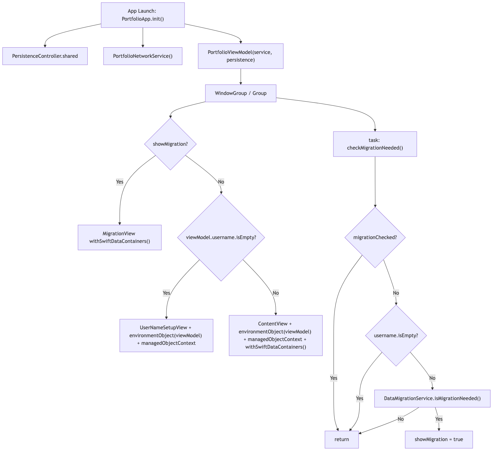
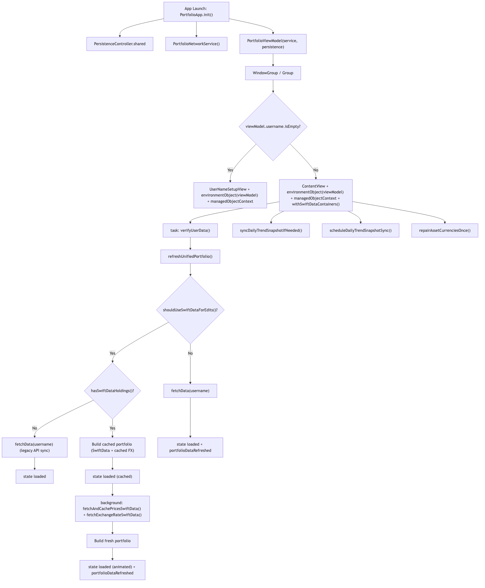

好久沒有寫這種靜態網頁的東西，這次被quarkus roq給吸引!

奇特的logo實在有點迷人😊

可能會記錄一下未來想要開發或是看到有趣的東西

目前應該會想要解決ios app 啟動過慢的問題 

1. 了解當前flow 並優化
2. 解決股價更新的快取機制問題 (目前太慢了，應該要考慮cloudflare kv)

也許再回補相關mermaid語法以及圖片，記錄一下🎉

```
flowchart TD
    A["App Launch: PortfolioApp.init()"] --> B["PersistenceController.shared"]
    A --> C["PortfolioNetworkService()"]
    A --> D["PortfolioViewModel(service, persistence)"]

    D --> E["WindowGroup / Group"]
    E --> F{"showMigration?"}
    F -->|Yes| G["MigrationView withSwiftDataContainers()"]
    F -->|No| H{"viewModel.username.isEmpty?"}
    H -->|Yes| I["UserNameSetupView + environmentObject(viewModel) + managedObjectContext"]
    H -->|No| J["ContentView + environmentObject(viewModel) + managedObjectContext + withSwiftDataContainers()"]

    E --> K["task: checkMigrationNeeded()"]
    K --> L{"migrationChecked?"}
    L -->|Yes| M["return"]
    L -->|No| N{"username.isEmpty?"}
    N -->|Yes| M
    N -->|No| O["DataMigrationService.isMigrationNeeded()"]
    O -->|Yes| P["showMigration = true"]
    O -->|No| M
```

更新成
```
flowchart TD
    A["App Launch: PortfolioApp.init()"] --> B["PersistenceController.shared"]
    A --> C["PortfolioNetworkService()"]
    A --> D["PortfolioViewModel(service, persistence)"]

    D --> E["WindowGroup / Group"]
    E --> F{"viewModel.username.isEmpty?"}
    F -->|Yes| G["UserNameSetupView + environmentObject(viewModel) + managedObjectContext"]
    F -->|No| H["ContentView + environmentObject(viewModel) + managedObjectContext + withSwiftDataContainers()"]

    H --> I["task: verifyUserData()"]
    I --> J["refreshUnifiedPortfolio()"]

    J --> K{"shouldUseSwiftDataForEdits()?"}
    K -->|Yes| L{"hasSwiftDataHoldings()?"}
    L -->|No| M["fetchData(username) (legacy API sync)"] --> N["state loaded"]
    L -->|Yes| O["Build cached portfolio (SwiftData + cached FX)"] --> P["state loaded (cached)"]
    P --> Q["background: fetchAndCachePricesSwiftData() + fetchExchangeRateSwiftData()"]
    Q --> R["Build fresh portfolio"] --> S["state loaded (animated) + portfolioDataRefreshed"]

    K -->|No| T["fetchData(username)"] --> U["state loaded + portfolioDataRefreshed"]

    H --> V["syncDailyTrendSnapshotIfNeeded()"]
    H --> W["scheduleDailyTrendSnapshotSync()"]
    H --> X["repairAssetCurrenciesOnce()"]
```
