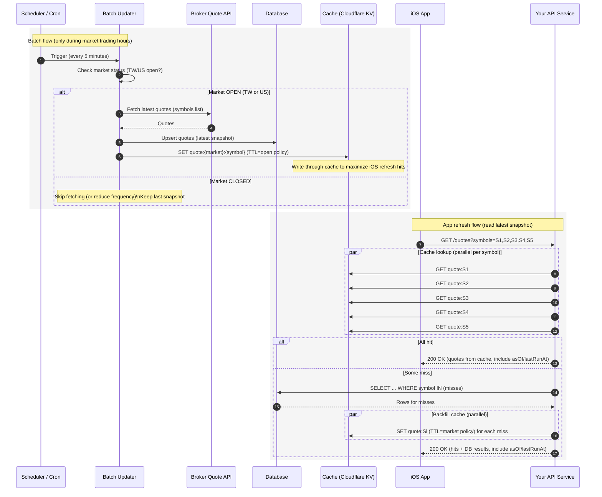
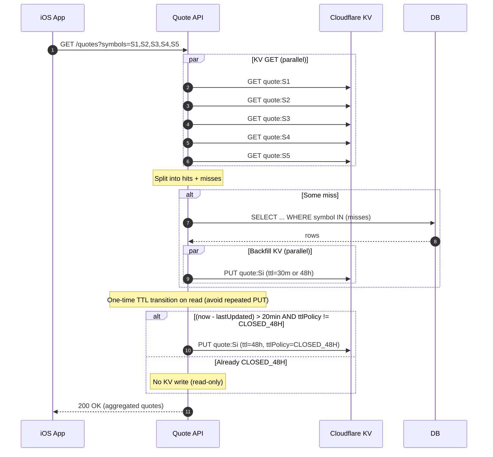
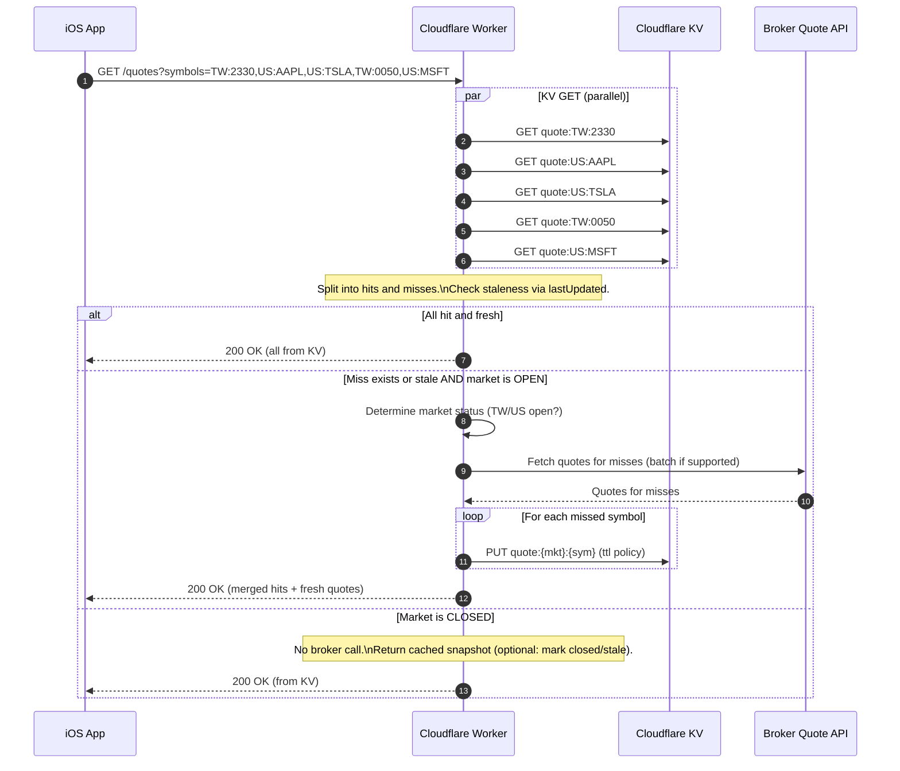

現行更新股價的方式有點慢且笨，應該要優化一下

## Batch update

從單筆變成一次發出全部的股票代號，針對這些進行更新。

現行有五筆股票可能就要發查五次，這樣會變成一次節省4次

## Stock price update mechanism



上面的 sequence diagram 分成兩條主線：**批次更新（Batch flow）**跟 **App 重新整理（Refresh flow）**。

可以把它想成「資料怎麼進來」跟「使用者怎麼讀出去」。

**批次更新（Batch flow：把最新股價寫進 DB + 快取）**

- Cron：每 5 分鐘觸發一次你的批次程式（Batch Updater）。

- Batch 先做一件事：**判斷台股/美股現在是不是交易時段**。

- **如果 OPEN**：

   Batch -> Broker API：向券商/報價來源抓最新報價（通常一次抓多檔）。

​	Batch -> DB：把最新報價寫入資料庫（upsert / 更新最新快照）。

​	Batch -> KV：同時把每檔最新報價寫到 KV（例如 quote:TW:2330）。

​	這一步是關鍵：叫做 **write-through cache**（寫入時同步更新快取）

​	好處是 iOS refresh 幾乎都會打到快取，不用再碰 DB（更快、更省 DB 負載）

- **如果 CLOSED**：

   Batch 直接跳過抓取，因為收盤後資料不會再變。

​	KV/DB 會保留最後一筆收盤價，提供 iOS 查詢。

**App 重新整理（Refresh flow：iOS 讀最新快照）**

- iOS -> API：iOS refresh 時呼叫你的 API，一次帶 5 個代號（batch request）。

   API 收到後，會對這 5 檔做**快取查詢**：

​	API -> KV GET quote:S1..S5：**每檔一個 key**，所以是 5 次 GET

​	但實作上會**並行**（同時發出去），所以延遲不會是 5 倍累加。

​	分兩種結果：

​	**全部命中（All hit）**：

​		API 直接把快取中的 quotes 彙整後回給 iOS（最快、最省資源）。

​	**部分未命中（Some miss）**：

​		API -> DB：把缺的那幾檔用 **一次查詢**（WHERE symbol IN (misses)）從 DB 撈回來

​		API -> KV SET：把這些 miss 的資料**回填快取**（backfill），下次就更容易命中

​		API -> iOS：回傳「快取命中的 + DB 補到的」完整結果

**為什麼這樣設計效果好**

- **iOS refresh 快**：大多數情況只讀 KV（讀取很快），不需要 DB。

- **DB 壓力小**：DB 主要被 batch 更新寫入；讀取只在快取 miss 時才發生。

- **符合交易時段**：交易時間才更新；收盤後不用一直回源，TTL 也能拉長，命中率更高。

- **一次 5 檔也 OK**：快取是 per-symbol，會查 5 次，但可並行；DB 只查 misses 且一次 IN。

## TTL

**開盤期間（Batch會持續寫入 KV）**

- **TTL：20–30 分鐘**

- 更新週期是 5 分鐘，TTL 設 20–30 分鐘表示你容忍連續 4–6 次批次沒成功，快取仍可用。

使用者 refresh 幾乎都會命中 KV；而且你仍可透過 ⁠lastUpdated 判斷是否「過久未更新」。

建議值：

- ⁠ttlOpen = 1800（30 分鐘）或 ⁠1200（20 分鐘）

**收盤期間（理論上不再變，由股價查詢API設定）**

- **TTL：24–72 小時**

- 收盤後不需要一直更新，TTL 拉長可讓 refresh 幾乎 100% 命中。

隔天開盤 batch 會再覆寫最新值。

建議值：

- ⁠ttlClosed = 172800（48 小時）或 ⁠86400（24 小時）

**關鍵實作：就算 TTL 很長，也要用** ⁠lastUpdated **判斷是否「太舊」**

API 在回傳時可以做一個簡單的 staleness 判斷：

在 KV value 裡加 ⁠marketStatus 或 ⁠ttlPolicy，讓「從 OPEN → CLOSED」只做一次，之後就不再寫。

- 如果 ⁠now - lastUpdated > 20 min **而且** ⁠ttlPolicy != CLOSED_48H

​	才做一次 ⁠put，把 ⁠marketStatus=CLOSED、⁠ttlPolicy=CLOSED_48H，並設定 ⁠ttl=48h

- 如果已經是 ⁠CLOSED_48H**不再寫**，直接回應即可

這樣不用靠 TTL 來「判斷資料新不新」，TTL 主要是避免快取消失造成 miss。




## KV value schema

```json
{
    "id": "67283b36447a55a757f87db3",
    "price": 178.07,
    "currency": "USD",
    "lastUpdated": "2026-01-21T04:55:52.3Z",
    "market": "US",
    "marketStatus": "OPEN",
    "ttlPolicy": "OPEN_20M"
}
```

## Further

似乎可以省略DB那一層，思考一下並計算流量限制



