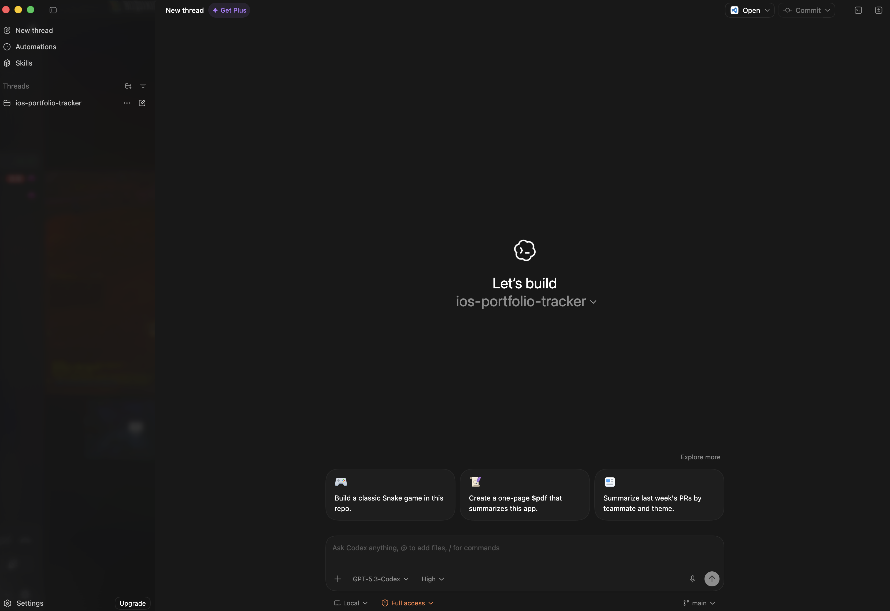

好用的開發工具!!!

## Codex

[Codex](https://openai.com/zh-Hant/index/introducing-the-codex-app/)

不是CLI也不是Cursor那種介面而是有點像是聊天對話視窗的感覺🎉

實際上使用感覺非常好~ plan mode 切換, worktree 的使用都是滿直覺的

介面上當然可以看到相關程式碼的異動(介面的設計讓程式碼不會成為焦點)

重點是那種對話完成程式搞定的感覺，非常順暢且直覺，價格也不貴

是其他相關開發工具給不出來的感覺。

未來應該會往

- Plan mode 執行完畢後應該要彙整起來當作 doc (結合 CHANGELOG.md)
- Worktree 搭配 branch 的廣泛使用 (多練習)
- 好用的 skills 搭配 (找尋幾個不錯的skill 試試看心得)