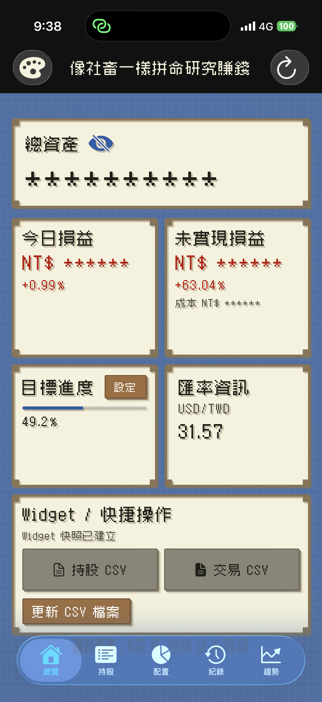
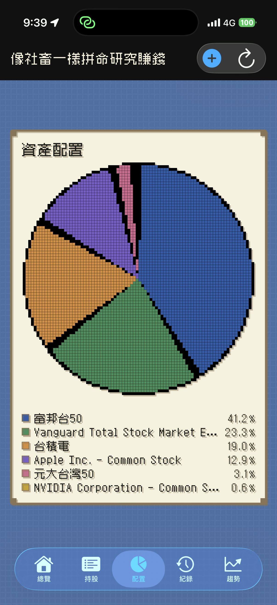
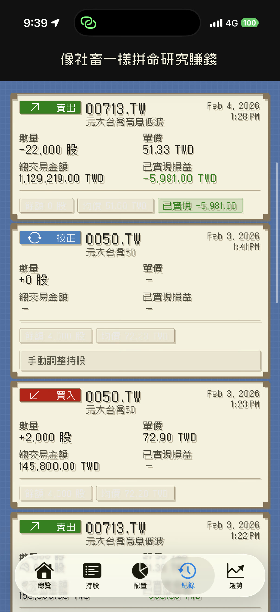
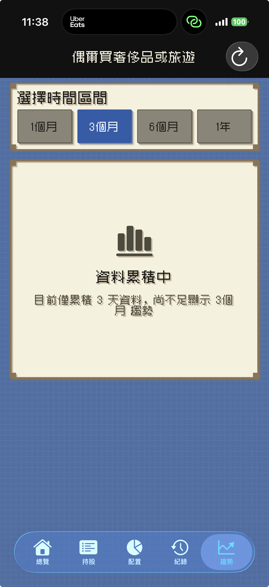
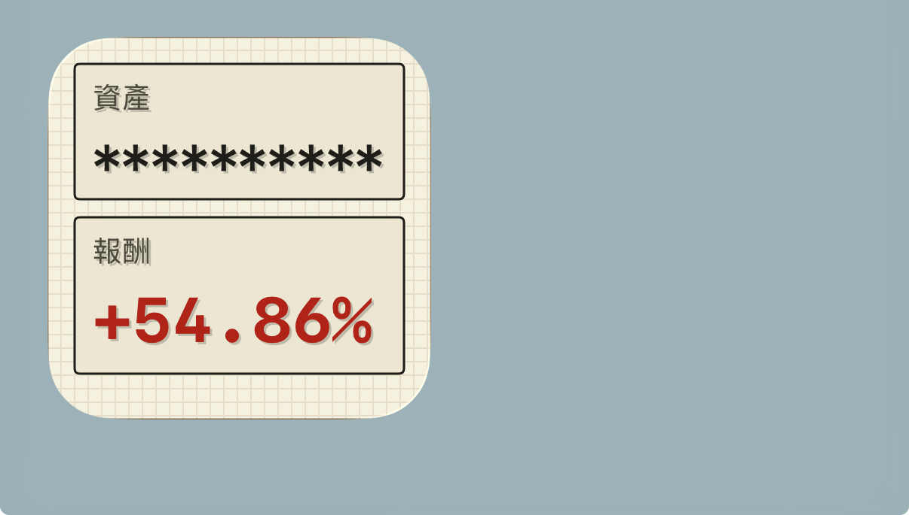

## InvestMate（像素風投資追蹤 App）

> InvestMate 是一款像素遊戲風格的投資追蹤 App。  
> 目標是把日常投資管理做得更有趣，同時保留清楚、可靠的資訊呈現。  
>  
> **本 App 僅用於整理與追蹤投資資料，不提供任何投資建議。**

* Support URL: https://chihkang.github.io/roq/  
* Support Email: [chihkang@me.com](mailto:chihkang@me.com)  
* GitHub Issues: https://github.com/chihkang/roq/issues  

---

## 功能概覽

你可以在同一個主題下查看以下頁面：

* **總覽**：快速掌握總資產與報酬  
* **持股**：檢視各標的部位、成本與損益  
* **配置**：用像素化圖表看資產分布  
* **紀錄**：集中管理買入 / 賣出 / 校正事件  
* **趨勢**：觀察一段時間內的資產變化  

---

## 主要特色

* **Pixel 像素遊戲風 UI**：一致的主題體驗，像在管理自己的像素小城  
* **主題切換架構**：後續可擴充不同視覺風格  
* **報酬顏色規則可調整**：  
    * 正綠負紅  
    * 正紅負綠  
* **支援 Widget**：重點資訊一眼可見  
* **支援 iCloud 同步**：同 Apple ID 可跨裝置同步資料  
* **重視可讀性**：小螢幕也能清楚看到關鍵數字  

---

### App Screenshots

### Widget Screenshots

### 操作影片（可選）

* Demo Video: https://share.icloud.com/photos/0a2Z1V8LG0PiyXU3whWbEGp7w

---

## 常見問題（FAQ）

### Q1：InvestMate 會提供投資建議嗎？
不會。InvestMate 主要用於**整理、記錄與追蹤**你的投資資料，不提供任何投資建議或買賣推薦。

### Q2：我的資料會同步到哪裡？
若你啟用 iCloud，同 Apple ID 的裝置可以進行同步。

### Q3：我可以自訂報酬顏色嗎？
可以，你可以切換顏色規則（例如正綠負紅 / 正紅負綠），依照自己的習慣閱讀。

---

## 支援與聯絡

遇到問題或想提供建議，歡迎透過以下方式聯絡：

* Email： [chihkang@me.com](mailto:chihkang@me.com)  
* GitHub Issues： https://github.com/chihkang/roq/issues  

回報問題時建議附上：

* iOS 版本、機型
* App 版本
* 問題截圖/錄影
* 重現步驟

---

## 隱私與資料

* iCloud 同步：使用者可選擇啟用 iCloud 進行跨裝置同步（同 Apple ID）。  
* 隱私權政策：_（如需要可在此補上連結，例如 `/roq/privacy`）_

---

## 版本紀錄（Changelog）

* **v1.0**
    * 初始版本：總覽 / 持股 / 配置 / 紀錄 / 趨勢  
    * Pixel 主題、主題切換架構  
    * Widget、iCloud 同步  
    * 報酬顏色顯示規則切換  

---

## 免責聲明

InvestMate 為個人投資資料管理工具，僅提供資訊整理與視覺化追蹤功能。  
所有內容不構成投資建議，投資決策與風險請自行承擔。

